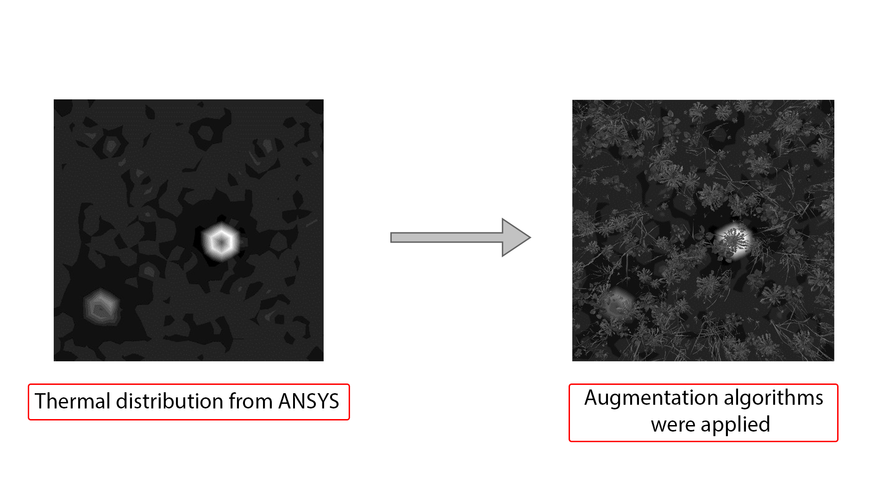

# MineGuard Models

Welcome to the MineGuard Models repository! This project contains models and datasets for landmine detection, blending real-world and simulated thermal data.

## Real Landmine Detection Example
Below is an example from the `media/real-landmine-detection` folder, showcasing real-world landmine detection:

*For more details, visit the [`media/real-landmine-detection` README](media/real-landmine-detection/README.md).*
