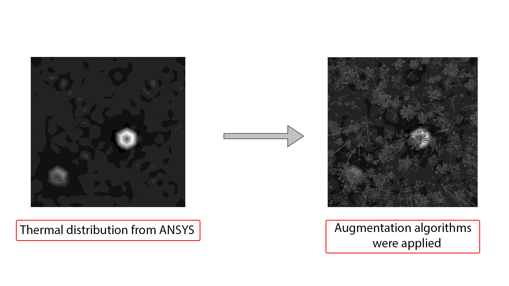

## Overview
The thermal model is a critical part of MineGuard, designed to process data from the drone's thermal imager. It utilizes the YOLOv8 framework to detect landmines based on their thermal signatures. This folder includes tools for generating synthetic thermal datasets, augmenting them with grass, and training the model.

## Workflow
A mathematical model was developed in **ANSYS APDL** to simulate the thermal behavior of landmines. A series of calculations generated images reflecting real-world thermal patterns. Due to their uniform nature, a custom augmentation pipeline was implemented:
- Random grass images were generated in **Blender** using `grass-augmentation.py`.
- These were combined with thermal images via `augmentation.py` to enhance dataset diversity.
- The resulting dataset was prepared for upload to **Roboflow** for training.

## Files
- **`thermal_model_train.ipynb`**: Jupyter notebook for training the thermal detection model using YOLOv8. It includes data loading, model configuration, training, and evaluation steps.
- **`augmentation.py`**: Python script that combines thermal images with synthetic grass to create augmented datasets for improved model performance.
- **`grass-augmentation.py`**: Python script for generating random grass scenes in Blender, used to augment thermal images with realistic backgrounds.

  

